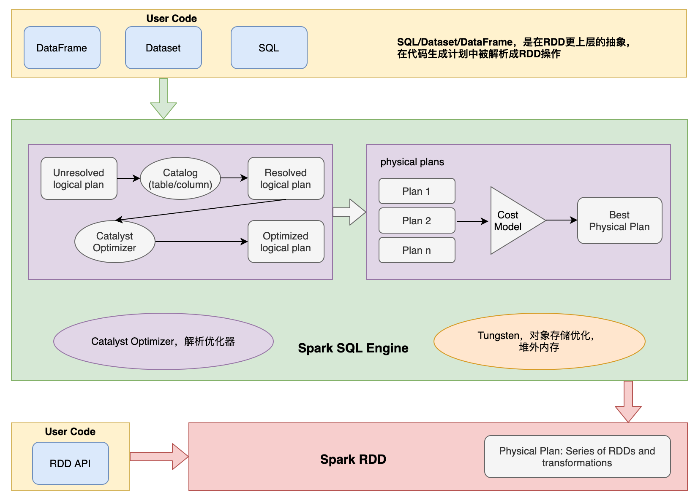
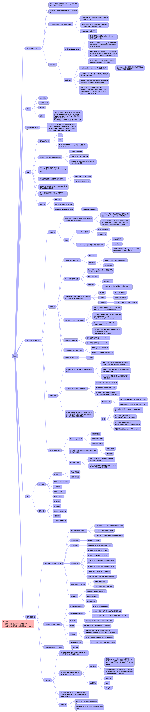

# What I know about spark

# How to run
```
sbt package

SPARK_HOME/spark-3.2.1-bin-hadoop3.2-scala2.13/bin/spark-submit \
--class zhiwin.spark.guide.MainApp \
--packages org.apache.logging.log4j:log4j-api:2.17.2,org.apache.logging.log4j:log4j-core:2.17.2 \
--jars ./jars/log4j-api-scala_2.13-12.0.jar \
--master "local[*]" \
target/scala-2.13/guide-things_2.13-1.0-SNAPSHOT.jar [stream | sql | rdd]

// yarn cluster
SPARK_HOME/spark-3.3.0-bin-hadoop3-scala2.13/bin/spark-submit \
--class zhiwin.spark.guide.MainApp \
--packages org.apache.logging.log4j:log4j-api:2.17.2,org.apache.logging.log4j:log4j-core:2.17.2 \
--jars ./jars/log4j-api-scala_2.13-12.0.jar \
--master yarn \
--deploy-mode cluster|client \
--executor-memory 1G \
--num-executors 2 \
target/scala-2.13/guide-things_2.13-1.0-SNAPSHOT.jar topn
```

# 知识结构梳理


# other practices
- [Flight Price Prediction](https://github.com/changzhiwin/flight-price)
- [Spark in Action ch01-17](https://github.com/changzhiwin/net.jgp.books.spark.ch17)